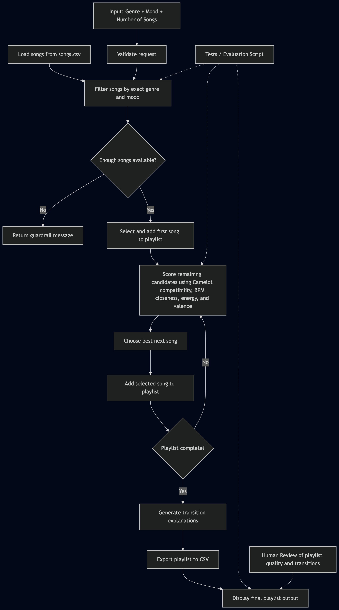

# TempoWave AI: An AI DJ for Harmonic Playlist Generation

## Title and Summary
TempoWave AI is an applied AI system that generates ordered playlists from a local music dataset using harmonic compatibility, BPM flow, energy/valence sequencing, and mood-specific rules. Instead of only recommending songs independently, it builds a complete no-repeat playlist designed to flow smoothly from one track to the next.

This project extends my earlier CodePath Module 3 project, **Music Recommender Simulation**. The original project focused on loading songs from a CSV file and ranking individual tracks based on user preferences such as genre, mood, and related music features. Its main goal was to simulate a recommendation engine for matching songs, while TempoWave AI expands that idea into full playlist construction and transition planning.

This project matters because playlist quality depends not only on what songs are chosen, but also on how they are sequenced. TempoWave AI approaches that problem as a structured AI task by combining constrained filtering, scoring logic, explainable transitions, and exportable results into one end-to-end system.

## Architecture Overview
TempoWave AI is organized as a modular pipeline that moves from user input to filtering, sequencing, explanation, and output. The system begins by loading a local CSV dataset, validating the request, and filtering songs by exact genre and exact mood so that playlist generation stays tightly constrained and consistent.

After filtering, the core AI logic selects the first song and then repeatedly scores the remaining candidates using Camelot compatibility, BPM closeness, energy, and valence. The system chooses the best next song, adds it to the playlist, and repeats this process until the requested number of songs has been reached.

Once the playlist is complete, TempoWave AI generates transition explanations and exports the final result to CSV. The architecture also includes guardrails to safely handle invalid requests or insufficient candidate pools, making the overall system easier to trust and reproduce.



## Setup Instructions
To run TempoWave AI, first clone the repository and enter the project folder. The project is designed to be lightweight and reproducible, using a local CSV dataset instead of requiring external APIs or authentication.

Create a virtual environment, activate it, and install the dependencies listed in `requirements.txt`. After setup, the main entry point can be run directly from the terminal, and the same environment can also be used to run the test suite and evaluation script.

This setup is intentionally simple so that another developer, recruiter, or instructor can run the project without guessing what to install or configure. Keeping the system local also makes it easier to demonstrate reliably in a portfolio setting. The only required dependency is `pytest` — the core system uses only the Python standard library.

```bash
git clone https://github.com/saam-kavusi/tempowave-ai.git
cd tempowave-ai
python3 -m venv .venv
source .venv/bin/activate
pip install -r requirements.txt
python3 main.py
python3 -m pytest tests/ -v
python3 evaluation/run_eval.py
```

## Sample Interactions
TempoWave AI accepts three inputs: **Genre**, **Mood**, and **Number of Songs**. Genre and mood are accepted case-insensitively (e.g. `rap`, `Rap`, and `RAP` all work). Valid song counts are **5**, **10**, or **15**. The system then filters the dataset, checks that enough matching songs exist, builds an ordered playlist, explains key transitions, and exports the result.

The examples below show how the same system produces different sequencing behavior depending on the playlist style.

### Example 1
**Input**
- Genre: EDM
- Mood: Chill
- Number of Songs: 5

**Output**
==========================================================
  TempoWave AI  |  EDM  ·  Chill  ·  5 songs
==========================================================
   1. red — ANDREWBATES
            BPM 120  |  key 4A  |  energy 3.0  |  valence 4.0
   2. Chill — Slushii
            BPM 124  |  key 11B  |  energy 4.0  |  valence 5.0
   3. Hide & Seek - Tiesto Remix — Imogen Heap, Tiesto
            BPM 130  |  key 11A  |  energy 5.0  |  valence 6.0
   4. ten — Fred Again...,Jozzy
            BPM 128  |  key 10A  |  energy 4.0  |  valence 5.0
   5. No Place - Will Clarke Remix — RUFUS DU SOL, Will Clarke
            BPM 125  |  key 10A  |  energy 4.0  |  valence 5.0

==========================================================
  TRANSITION EXPLANATIONS
==========================================================
  [ 1] "red" — ANDREWBATES  (opening track)
       Energy: 3  BPM: 120  Key: 4A
  [ 2] "Chill" — Slushii
       Key:    4A → 11B  (best option available)
       BPM:    120 ↑ 124  (diff 4)
       Energy: 3 ↑ 4
       Valence:4 ↑ 5

### Example 2
**Input**
- Genre: Rap
- Mood: Workout
- Number of Songs: 10

**Output**
=== TempoWave AI ===
Available genres : Rap, EDM, Pop
Genre           : rap
Available moods  : Workout, Vibe, Chill
Mood            : workout
Song counts      : [5, 10, 15]
Number of songs : 5

==========================================================
  TempoWave AI  |  Rap  ·  Workout  ·  5 songs
==========================================================
   1. Till I Collapse — Eminem
            BPM 171  |  key 3B  |  energy 9.0  |  valence 4.0
   2. Lucky You — Eminem, Joyner Lucas
            BPM 153  |  key 3A  |  energy 9.0  |  valence 5.0
   3. Ni**as In Paris — JAY-Z, Kanye West
            BPM 140  |  key 3B  |  energy 9.0  |  valence 5.0
   4. Roll in Peace — Kodak Black, XXXTENTACION
            BPM 140  |  key 3A  |  energy 8.0  |  valence 4.0
   5. Standard — Stormzy
            BPM 140  |  key 11B  |  energy 8.0  |  valence 5.0

==========================================================
  TRANSITION EXPLANATIONS
==========================================================
  [ 1] "Till I Collapse" — Eminem  (opening track)
       Energy: 9  BPM: 171  Key: 3B
  [ 2] "Lucky You" — Eminem, Joyner Lucas
       Key:    3B → 3A  (harmonically compatible)
       BPM:    171 ↓ 153  (diff 18)
       Energy: 9 → 9
       Valence:4 ↑ 5

### Example 3
**Input**
- Genre: Pop
- Mood: Vibe
- Number of Songs: 15

**Output**
==========================================================
  TempoWave AI  |  Pop  ·  Vibe  ·  15 songs
==========================================================
   1. MEMORIES! — 347aidan
            BPM 155  |  key 11B  |  energy 6.0  |  valence 7.0
   2. Broken — THEY., Jessie Reyez
            BPM 132  |  key 11B  |  energy 5.0  |  valence 5.0
   3. Cliche — MGK
            BPM 105  |  key 10B  |  energy 5.0  |  valence 6.0
   4. Into You — Ariana Grande
            BPM 108  |  key 11B  |  energy 7.0  |  valence 8.0
   5. Replay — Iyaz
            BPM 91  |  key 11B  |  energy 7.0  |  valence 8.0
   6. A Bar Song (Tipsy) — Shaboozey
            BPM 81  |  key 11B  |  energy 7.0  |  valence 9.0
   7. My Love — Major Lazer, Wizkid, Wale, Dua Lipa
            BPM 115  |  key 9B  |  energy 7.0  |  valence 8.0
   8. She Doesn't Mind — Sean Paul
            BPM 120  |  key 6A  |  energy 7.0  |  valence 8.0
   9. Desert Rose — Sting, Cheb Mami
            BPM 112  |  key 5A  |  energy 6.0  |  valence 7.0
  10. Waiting for Tonight — Jennifer Lopez
            BPM 125  |  key 3A  |  energy 7.0  |  valence 8.0
  11. Maps — Maroon 5
            BPM 120  |  key 12A  |  energy 7.0  |  valence 8.0
  12. 2002 — Anne- Marie
            BPM 96  |  key 12A  |  energy 6.0  |  valence 8.0
  13. Stay The Night — Zedd, Hayley Williams
            BPM 128  |  key 4B  |  energy 6.0  |  valence 8.0
  14. California — Anthony Russo
            BPM 142  |  key 6B  |  energy 6.0  |  valence 7.0
  15. Don't Blame Me — Taylor Swift
            BPM 136  |  key 8A  |  energy 6.0  |  valence 6.0

==========================================================
  TRANSITION EXPLANATIONS
==========================================================
  [ 1] "MEMORIES!" — 347aidan  (opening track)
       Energy: 6  BPM: 155  Key: 11B
  [ 2] "Broken" — THEY., Jessie Reyez
       Key:    11B → 11B  (perfect key match)
       BPM:    155 ↓ 132  (diff 23)
       Energy: 6 ↓ 5
       Valence:7 ↓ 5

## Design Decisions
TempoWave AI was designed to stay focused, reproducible, and realistic by using a local CSV dataset instead of relying on external APIs or streaming integrations. I chose curated music features such as BPM, Camelot key, energy, and valence so the system could produce musically informed playlist sequencing while remaining explainable and manageable within project scope.

Another key design choice was to emphasize constrained playlist construction over broad personalization. This kept the system aligned with the project’s goals by making the output easier to test, explain, and evaluate while still demonstrating meaningful applied AI behavior.

## Testing Summary
TempoWave AI includes guardrails, unit tests, and an evaluation script to verify that the system behaves reliably across different inputs. The testing focuses on core behaviors such as exact filtering, request validation, harmonic compatibility logic, no-repeat playlist construction, and safe handling of insufficient-song cases.

The automated test suite now contains **78 tests**, and all **78 pass**. These tests cover filtering, guardrails, harmonic compatibility, playlist planning, and the newer interactive input-handling behavior such as case-insensitive genre/mood input and re-prompting on invalid genre, mood, or song count entries.

In addition to the unit tests, the evaluation script successfully runs 3 demo playlist cases and 3 guardrail failure cases, confirming that invalid genre, mood, and count inputs are blocked with clear error messages. This testing process showed that the system does more than produce plausible outputs — it behaves consistently under both normal and invalid input conditions, which makes it easier to explain, trust, and demonstrate professionally.

## Loom Walkthrough
https://www.loom.com/share/e9d683ab6bbf4647b46ac50161b91f19


## Reflection
This project taught me how to turn a simpler recommendation prototype into a more complete applied AI system with clearer structure, stronger constraints, and more explainable outputs. It also reinforced the importance of balancing ambition with practicality by building something specialized, testable, and polished enough to present professionally in a portfolio.

It also changed the way I think about recommendation systems by showing that sequence and transition quality can matter just as much as matching individual items to user preferences.