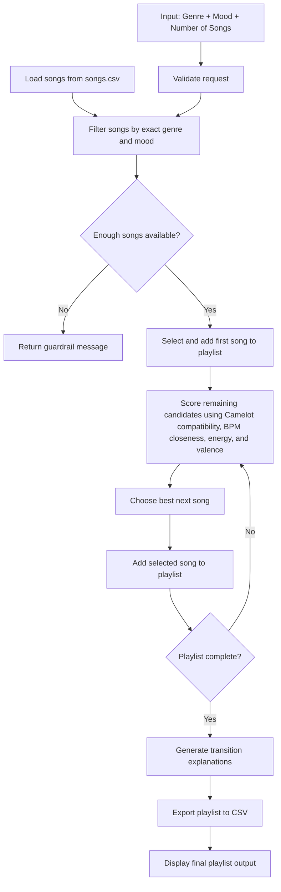

```mermaid
flowchart TD
    A[Input: Genre + Mood + Number of Songs]
    B[Load songs from songs.csv]
    C[Validate request]
    D[Filter songs by exact genre and mood]
    E{Enough songs available?}
    F[Return guardrail message]
    G[Select and add first song to playlist]
    H[Score remaining candidates using Camelot compatibility, BPM closeness, energy, and valence]
    I[Choose best next song]
    J[Add selected song to playlist]
    K{Playlist complete?}
    L[Generate transition explanations]
    M[Export playlist to CSV]
    N[Display final playlist output]

    A --> C
    B --> D
    C --> D
    D --> E
    E -- No --> F
    E -- Yes --> G
    G --> H
    H --> I
    I --> J
    J --> K
    K -- No --> H
    K -- Yes --> L
    L --> M
    M --> N
```
